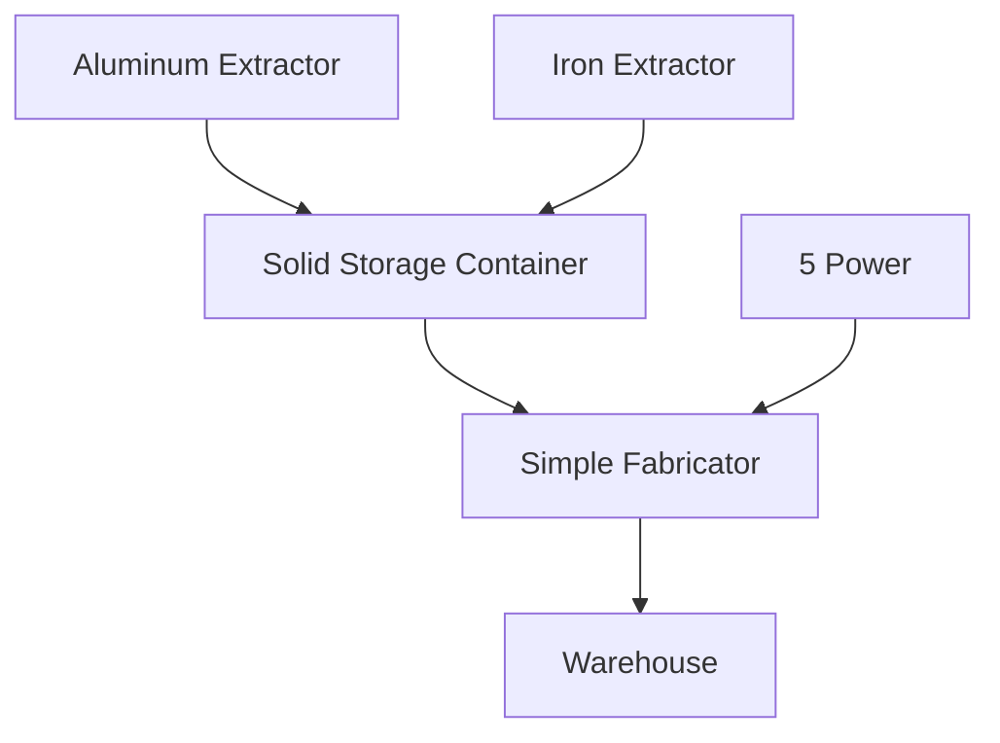

+++
title = 'Adaptive Frame'
type = 'resource'
+++
{}

## Supply Chain
You can automate the manufactoring like this:

```mermaid
flowchart TD
    A[Aluminum Extractor]
    B[Iron Extractor]
    C[Solid Storage Container]
    D[Simple Fabricator]
    E[Warehouse]
    F[5 Power]

    A --> C
    B --> C
    C --> D
    D --> E
    F --> D
```